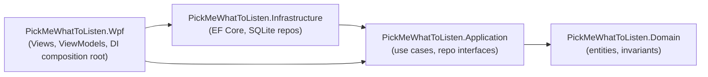

# Architecture

## Layers

Dependencies only ever point left. `Domain` knows nothing about the other
three projects; `Application` knows only `Domain`; `Infrastructure` and `Wpf`
both know `Application`, but not each other's internals beyond the DI
registration surface (`AddInfrastructure()`).

These rules are meant to be checked mechanically by
`tests/PickMeWhatToListen.ArchitectureTests` (NetArchTest) once that project
is filled in — see `docs/exec-plans/active/` for status.

## Project responsibilities

### `PickMeWhatToListen.Domain`
Plain entities and invariants, zero project/package references besides the
BCL. Currently just `Artist`, which owns:
- Its own validation (`Artist.Create` trims/validates the name).
- The `IsPicked` / `PickedAtUtc` invariant: `Pick()` throws if already picked.
  `IsPicked` is a **persistent** listened/not-listened marker, not a
  single "currently highlighted" flag.

### `PickMeWhatToListen.Application`
Use cases and ports. `ArtistCatalogService` is the only entry point UIs
should call: `AddArtistAsync`, `GetAllArtistsAsync`, `PickRandomAsync`.
`PickRandomAsync` returns an `ArtistPickResult` (not an exception) because
"nothing left to pick" is an expected, user-facing outcome.

Ports defined here, implemented in `Infrastructure`:
- `Abstractions/IArtistRepository.cs`
- `Abstractions/IRandomProvider.cs` (kept abstract so the random draw is
  deterministic/testable; the real implementation just wraps `Random.Shared`)

### `PickMeWhatToListen.Infrastructure`
EF Core + SQLite adapters. Nothing outside this project may reference
`Microsoft.EntityFrameworkCore.*`.

- `AppDbContext` / `ArtistConfiguration`: EF Core mapping. Notably,
  `CreatedAtUtc`/`PickedAtUtc` are stored as UTC ticks (`long`), **not**
  `DateTimeOffset`, because the SQLite provider can't translate `ORDER BY`
  over `DateTimeOffset` columns (throws `NotSupportedException` at query
  time, not migration time — see `docs/exec-plans/active/`).
- `EfArtistRepository` uses `IDbContextFactory<AppDbContext>` (via
  `AddDbContextFactory`) and creates a short-lived context per method call,
  instead of holding one long-lived injected `DbContext`. This is the
  recommended EF Core pattern for apps with no natural per-operation DI
  scope (WPF has no "request" boundary, and `DbContext` isn't thread-safe).
- `DatabaseMigrator.MigrateAsync(IServiceProvider)`: applies pending
  migrations. Takes a plain `IServiceProvider` so the WPF composition root
  can call it without importing EF Core types.
- `AppDbContextFactory : IDesignTimeDbContextFactory<AppDbContext>`: lets
  `dotnet ef migrations add` run without booting the WPF host.
- `ServiceCollectionExtensions.AddInfrastructure()`: the only thing `Wpf`
  needs to call to wire persistence + `IRandomProvider` into the container.

The SQLite file lives at `%AppData%\PickMeWhatToListen\catalog.db`
(`AppDataDatabasePathProvider`), applied via EF Core migrations
(`Database.MigrateAsync`), never `EnsureCreated` — so future schema changes
(discography, tags, albums) are additive migrations, not a re-seed.

### `PickMeWhatToListen.Wpf`
Composition root + UI. `App.xaml.cs` builds a `HostApplicationBuilder`,
calls `AddInfrastructure()`, registers `ArtistCatalogService` and the
ViewModels/Window, migrates the DB, then shows `MainWindow`.

`MainViewModel` (CommunityToolkit.Mvvm, `[ObservableProperty]`/`[RelayCommand]`)
is the only class that talks to `ArtistCatalogService`; `ArtistRowViewModel`
is a read-only display snapshot for the list. Views never touch EF Core or
SQL.

**Gotcha:** always fully-qualify `System.Windows.Application` in this
project. The sibling `PickMeWhatToListen.Application` project namespace
shadows the unqualified `Application` name for every type declared under
`PickMeWhatToListen.Wpf`, because C# namespace-member lookup wins over
using-directives. See `App.xaml.cs` for the fix in practice and
`.cursor/rules/mvvm-wpf.mdc` for the rule.

**Gotcha:** `InvariantGlobalization` is `false` for this project even though
`Directory.Build.props` sets it `true` repo-wide — WPF's data-binding engine
calls `XmlLanguage.GetSpecificCulture()` at startup and crashes under
invariant globalization.

## Persistence model (current)

`Artists` table (see `docs/generated/db-schema.md` for the generated view):

| Column        | Type    | Notes                                   |
|---------------|---------|------------------------------------------|
| Id            | TEXT    | GUID primary key                         |
| Name          | TEXT    | required, max 200 chars                  |
| CreatedAtUtc  | INTEGER | UTC ticks (see SQLite `DateTimeOffset` gotcha above) |
| IsPicked      | INTEGER | boolean, indexed                         |
| PickedAtUtc   | INTEGER | nullable, UTC ticks                      |

## Out of scope (for now)

Discography sync, release-date tracking, and tagging are intentionally not
modeled yet. See `docs/product-specs/future-ideas.md` for backlog headings —
none of them should influence today's schema until they're specced.
